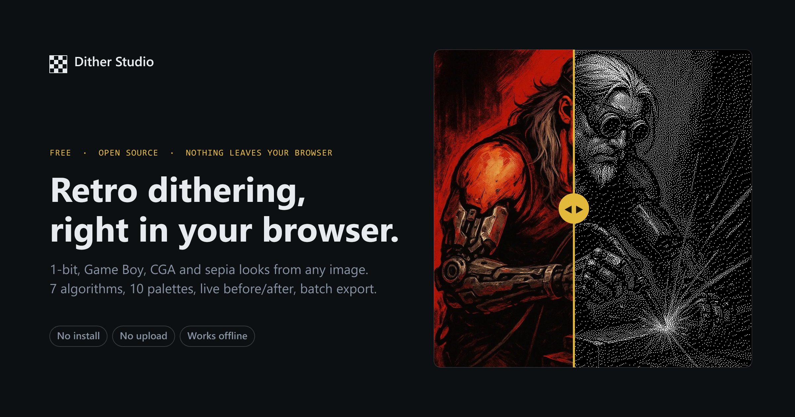

# Dither Studio

**Retro image dithering, right in your browser.** Turn any picture into 1-bit pixel art,
a Game Boy screenshot, a CGA screen or an old sepia print — then export it as a PNG.

**→ [zed2101.github.io/dither-studio](https://zed2101.github.io/dither-studio/)**



---

## Features

- **7 dithering algorithms** — Floyd–Steinberg, Atkinson, Jarvis–Judice–Ninke,
  ordered Bayer 8×8, plain threshold, noise threshold and halftone dots.
- **10 palettes** — black & white, 4 and 16 grays, Game Boy, CGA, EGA 16, sepia,
  a 16-step brown ramp, 8-colour RGB, plus a custom palette you build yourself
  with as many colours as you like.
- **Live before/after** — drag the slider across the image to compare the original
  with the dithered version. Scroll or pinch to zoom up to 16×, drag to pan,
  double-click to reset.
- **Real controls** — pixel size, brightness/threshold, diffusion strength and
  halftone dot grid, all updating as you drag.
- **Batch friendly** — drop in several images at once, switch between them, and
  export the whole set as a single ZIP.
- **Export anywhere** — download a full-resolution PNG, copy straight to the
  clipboard, or grab the ZIP.
- **Light and dark theme**, remembered between visits.
- **Drag & drop, file picker or Ctrl+V** to bring images in.

## About

Dither Studio is a single static page. There is no build step, no framework and no
dependency — just `index.html`, `styles.css` and `app.js`, served straight from
GitHub Pages.

Everything happens on your own machine. Images are decoded, dithered and exported
locally in a `<canvas>`; nothing is ever uploaded, and no analytics or trackers are
loaded. Once the page is open it keeps working offline, and you can save the three
files and open `index.html` from disk if you prefer.

A couple of notes on how it dithers, since it changes how the output looks:

- Palettes that sit on a **single tonal ramp** (the grays, sepia, browns, Game Boy)
  are dithered in luminance space instead of per RGB channel. That keeps the tone
  clean rather than letting channel error introduce colour speckle.
- The **Game Boy** palette is remapped rather than luminance-matched. Its four
  greens only span about 44–169 of the luminance scale, so a straight match would
  collapse every highlight onto the lightest green; instead the full 0–255 range
  is spread across the four steps, which is what the hardware actually did.
- Error diffusion accumulates in a **float buffer** with explicit edge checks, so
  gradients keep their detail and error from the right edge doesn't wrap into the
  next row.

## Running it locally

Clone the repository and open `index.html`. That's it.

```bash
git clone https://github.com/Zed2101/dither-studio.git
```

If your browser is strict about local files, serve the folder over HTTP instead:

```bash
python -m http.server 8000
```

## Credits

Built by [Daniel Crantoc](https://github.com/Zed2101).
Fonts: [DM Sans](https://fonts.google.com/specimen/DM+Sans) and
[JetBrains Mono](https://fonts.google.com/specimen/JetBrains+Mono).

## License

[MIT](LICENSE)
